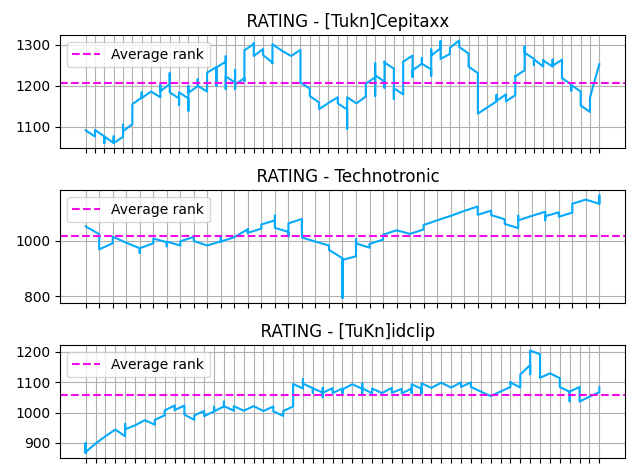

# Data Visualization

Data visualization projects of personal interests

Tools used :

Python 3,
Matplotlib,
API Requests,
Json file manipulation,

## SUBPLOTS + MEAN

## PIE PLOT

## MULTIPLE AXES SUBPLOT FIGURE

